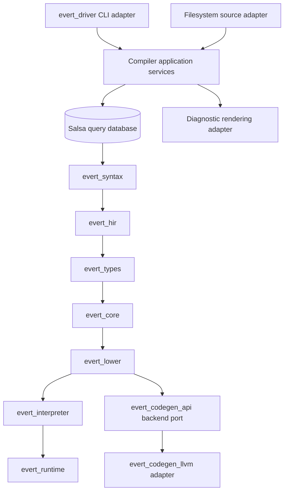
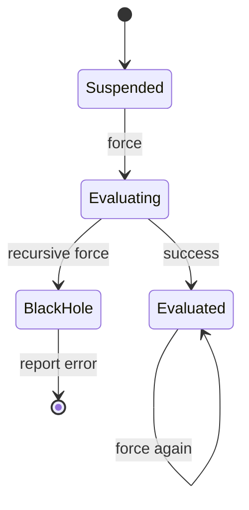

# Evert design

- **Status:** Living design, initial architecture.
- **Scope:** Evert language specification and Rust reference compiler through
  the interpreter-first MVP, with staged native backend and advanced runtime
  features.
- **Audience:** Compiler implementers, language designers, reviewers, and
  tooling authors.
- **Companion documents:** `docs/context.md`, `docs/terms-of-reference.md`,
  `docs/roadmap.md`, `docs/adr-001-query-based-compiler-workspace.md`,
  `docs/adr-002-interpreter-first-backend-boundary.md`,
  `docs/adr-003-local-power-language-semantics.md`,
  `docs/adr-004-effect-interface-sealing-gate.md`,
  `docs/adr-005-capability-authority-staging.md`,
  `docs/references/inciting-incident.md`, and `docs/references/evert-plan.md`.
- **Last substantive revision:** 2026-06-27.

## 1. Problem statement

Evert is a strict-by-default functional systems language whose central rule is
that power should be local, explicit, and non-contagious. The language keeps
purity, laziness, algebraic data types, monads, algebraic effects, local
mutation, structured concurrency, ownership, capabilities, and unsafe system
work available, but it rejects making any one mechanism the ambient shape of
the whole programme.

The reference compiler must prove that rule. A compiler that parses the syntax
but cannot enforce empty effect rows for `pure fn`, pure-only laziness,
non-escaping mutation, or handler boundaries has not implemented Evert. A
compiler that goes directly to LLVM before it has an executable semantic oracle
will make backend defects look like language defects. Evert therefore needs a
specification-backed, interpreter-first compiler architecture with clear ports,
stable intermediate representations, and conformance tests tied to the ECLP
corpus.

## 2. Goals and non-goals

### 2.1. Goals

- Split the ECLP source material into normative proposal documents with
  statuses, dependencies, examples, and conformance expectations.
- Build a Rust-hosted compiler with a lossless syntax front end, stable
  semantic identifiers, row-polymorphic type and effect checking, typed Core
  IR, and a tree-walking Core interpreter.
- Treat diagnostics as a language feature by preserving source spans, trivia,
  recovery nodes, and user-facing construct names through the pipeline.
- Keep the compiler domain independent from the command-line interface,
  filesystem, diagnostic renderer, interpreter host, and LLVM backend through
  explicit ports and adapters.
- Let the front end and interpreter build without LLVM installed.
- Specify structured concurrency, ownership, capabilities, unsafe code,
  editions, and typed metaprogramming before executing their full runtime
  behaviour.

### 2.2. Non-goals

- The initial design does not promise production language stability.
- The MVP does not include a hosted package registry, graphical interface, or
  language-server binary.
- The MVP does not require native object emission or an embedded LLVM backend.
- The MVP does not execute the complete structured-concurrency, actor,
  protocol, capability, unsafe foreign-function interface, or metaprogramming
  surface.
- The MVP does not allow `lazy` to defer effectful work. Effectful deferral
  belongs to future task or structured-concurrency constructs.
- The language does not include subtyping, type-level computation, or quantum
  primitives in version one.

## 3. Prior art and design consequences

| Source                                               | Design consequence for Evert                                                                                              |
| ---------------------------------------------------- | ------------------------------------------------------------------------------------------------------------------------- |
| Koka and Links row-polymorphic effect types          | Function arrows carry effect rows, and type inference must solve type and effect constraints together.                    |
| Plotkin and Pretnar algebraic handlers               | Effects are operation sets interpreted by handlers; handlers can eliminate, transform, or re-emit operations.             |
| Signature restriction and abstract algebraic effects | Open polymorphic effects need an interface-sealing escape hatch if effect capabilities start leaking through abstraction. |
| Non-monadic and higher-order handler work            | Monads should stay ordinary abstractions; handlers need their own source concept and preservation tests.                  |
| Unison abilities                                     | User-facing effects should explain operations and handlers operationally, not only as compiler theory.                    |
| Lazy sharing and black-hole semantics                | `lazy` needs an explicit sharing state machine and black holes must be visible runtime states, not host panics.           |
| Lazy type-system work                                | Strict-by-default evaluation avoids making laziness a pervasive inference problem.                                        |
| ST-style encapsulation and logical relations         | Local mutation can preserve external purity when the type system proves heap independence and region non-escape.          |
| Affine resources and capability session types        | Ownership and capabilities should be staged as authority and resource contracts, not bolted onto every ordinary binding.  |
| rust-analyzer syntax architecture                    | Syntax trees stay lossless and semantic-free, while later representations carry names, types, and meaning.                |
| Parser error-recovery literature                     | Recovery is part of the compiler contract; incomplete input should still produce useful trees and diagnostics.            |
| Salsa overview                                       | Compiler facts should be deterministic tracked computations over explicit inputs.                                         |
| Rust compiler HIR/MIR and GHC Core design            | Evert should lower through semantic and typed intermediate representations before backend-specific code.                  |
| Typed intermediate-language work                     | Typed IR scales only when each stage keeps type representation deliberate and bounded.                                    |
| Swift and OpenJDK structured concurrency             | Child tasks must have lexical lifetimes, cancellation propagation, and observable parent-child relationships.             |
| Structured-concurrency and cancellation literature   | Task scopes, handler interaction, and cooperative cancellation need their own proof targets before runtime breadth.       |

_Table 1: Prior-art findings that affect design decisions._

These sources do not make Evert a copy of any one system. They identify the
implementation hazards: effects must be typed, laziness must not hide effect
timing, local mutation needs an escape boundary, typed IR must stay manageable,
and concurrent tasks need scope. Evert's distinct choice is to make each hazard
visible in the source construct that introduces it.

## 4. Architectural style

Evert uses a hexagonal compiler architecture. The compiler domain owns the
language concepts, intermediate representations, semantic invariants, and
ports. Adapters connect that core to the outside world.

For screen readers: Figure 1 shows source text entering the compiler through a
driver adapter, moving inward through parsing, HIR, type checking, Core, and
interpretation, while diagnostic, source-loading, and backend adapters remain
outside the compiler core.



_Figure 1: Hexagonal compiler architecture with adapter boundaries._

The dependency rule is inward:

- Domain crates do not import CLI, filesystem, renderer, or LLVM adapter
  types.
- Ports use Evert compiler types, not infrastructure-specific handles.
- Adapters never call each other directly; compiler application services
  coordinate them.
- LLVM contexts, modules, builders, and target handles never enter the Salsa
  database.

## 5. Workspace and component responsibilities

| Crate                | Responsibility                                                                   | Boundary             |
| -------------------- | -------------------------------------------------------------------------------- | -------------------- |
| `evert_span`         | File identities, byte spans, source maps, and interned symbols                   | Domain support       |
| `evert_syntax`       | Logos tokens, layout expansion, Chumsky parser, CST, and AST views               | Domain front end     |
| `evert_db`           | Salsa inputs, tracked queries, interned identifiers, and diagnostic accumulation | Application spine    |
| `evert_hir`          | Module scopes, name resolution, desugaring, and `DefId` assignment               | Semantic domain      |
| `evert_types`        | Kinds, type inference, effect rows, traits, coherence, and exhaustiveness        | Semantic domain      |
| `evert_core`         | Explicitly typed Core IR and deterministic pretty-printing                       | Semantic domain      |
| `evert_lower`        | Closure, thunk, dictionary, handler, and selected continuation lowering          | Semantic domain      |
| `evert_interpreter`  | Tree-walking Core interpreter and semantic oracle                                | Driven port consumer |
| `evert_runtime`      | Runtime values, thunks, capabilities, text, resources, and host operations       | Runtime domain       |
| `evert_codegen_api`  | Backend trait, target model, and backend artefact contract                       | Driven port          |
| `evert_codegen_llvm` | Optional textual and embedded LLVM backend implementation                        | Driven adapter       |
| `evert_driver`       | Command-line interface, package loading, orchestration, and output selection     | Driving adapter      |

_Table 2: Initial crate responsibilities._

The workspace starts with the crates needed for the first committed slice. The
roadmap should not create all crates as empty placeholders. A crate earns its
place when a task needs its boundary and can validate it.

## 6. Compiler pipeline

The compiler pipeline follows the source material's stack:

```text
source text
  -> raw spanned tokens
  -> layout expansion
  -> lossless CST and typed AST views
  -> HIR and stable definition identifiers
  -> kind, type, trait, and effect inference
  -> explicitly typed Core
  -> closure, thunk, dictionary, and handler lowering
  -> interpreter or backend port
```

The pipeline is query-based. Each stage consumes stable outputs from earlier
queries and returns immutable values suitable for memoization and testing. The
driver owns source input mutation. Query functions are deterministic over their
inputs.

The first query graph is:

```text
source(FileId)
tokens(FileId)
layout_tokens(FileId)
parsed_file(FileId)
item_tree(FileId)
module_scope(ModuleId)
resolved_body(DefId)
inferred_signature(DefId)
typed_body(DefId)
core_body(DefId)
lowered_body(DefId)
interpreted_entry(EntryPointId)
```

Backend-specific queries are not in the MVP graph. Native code generation
starts as an adapter over lowered modules once the interpreter can execute the
same Core programmes.

## 7. Syntax and source fidelity

Evert needs a lossless front end because formatting, diagnostics, recovery, and
future editor features all depend on source fidelity.

The syntax layer has four contracts:

- Tokens carry byte spans and token kind.
- Trivia is retained for the CST and formatting.
- The layout pass injects explicit `Indent`, `Dedent`, and `Newline` tokens
  before parsing.
- Syntax remains semantic-free; HIR owns names, types, effects, and module
  meaning.

The parser should recover from common mistakes and produce partial syntax
trees. Diagnostics should then report the construct the user appeared to be
writing. A parser error that says "expected parameter name" at
`fn greet(: Text)` is useful. An error that exposes generated parser rule names
is a design failure.

## 8. Semantic model

### 8.1. Types and effects

Evert's type checker solves ordinary types and effect rows together. A function
type has this shape:

```text
Parameter -> Result ! EffectRow
```

`pure fn` is not documentation. It is a compiler assertion that the inferred
effect row is empty. Public declarations require explicit type and effect
signatures; private declarations may infer them, but hover and diagnostic
surfaces should display inferred signatures.

The first effect set should be small:

- `Throw<E>` for typed early exit.
- `Console` for examples and diagnostics.

`Clock` is specified but staged. It is the first candidate for a
non-deterministic capability effect once ADR 005's authority model has
conformance fixtures. It is not part of the first executable effect slice.

Effects and handlers are the first hard semantic surface after pure code. The
compiler must be able to show row soundness, handler preservation, and
non-escape of effect capabilities before advanced ownership, task, or mutation
execution features are treated as implementation promises.

ADR 004 makes signature restriction or effect-interface sealing an early gate.
The first checker may start without sealing, but Evert cannot broaden open
polymorphic effect interfaces, capability-bearing effects, or general handler
libraries until fixtures show that the current model is safe or a sealing ADR
is accepted.

The type checker must reject:

- calling an effectful operation from `pure fn`,
- hiding effects inside `lazy`,
- leaving required public effect signatures implicit,
- incoherent or orphan trait instances,
- non-exhaustive matches over closed types,
- local mutable cells that escape their region.

### 8.2. Monads

Monads are ordinary abstractions expressed through traits and `do M { ... }`.
They are not the effect system. `do Option` and `do Result` lower to trait
dictionaries and ordinary Core calls. Direct-style effects lower through
`perform` and handlers. The compiler may share continuation machinery after
lowering, but source users should see distinct concepts.

### 8.3. Laziness

Evert is strict by default. `lazy` creates a suspended pure computation that is
evaluated at most once and memoized after success.

For screen readers: Figure 2 shows a lazy thunk moving from suspended, to
evaluating, to evaluated. Re-entering an evaluating thunk reports a black-hole
error.



_Figure 2: Lazy thunk state machine._

The runtime must distinguish a semantic black-hole diagnostic from host panics.
Concurrent forcing is specified later; the first interpreter can serialize
forcing while preserving the state-machine contract.

`lazy` is not the construct for deferred effects. A later `Task`, `Future`, or
structured-concurrency construct may defer effectful work, but such work must
carry task and cancellation semantics rather than hiding inside thunk forcing.

### 8.4. Local mutation

`mutate` creates a lexical region. Mutable cells carry an implicit region
identity, and the type checker prevents them from escaping. `freeze` consumes a
mutable builder and produces an immutable value. A pure function may contain
`mutate` only when all mutation is encapsulated.

This is the Evert version of the ST insight: implementation may use in-place
state, but callers observe a pure value.

Local mutation is part of the language thesis, but it is stage-sensitive. The
compiler should specify and test region non-escape before shipping execution
semantics. The first interpreter slice may defer executable `mutate` if pure
code, handlers, and pure laziness can validate the core thesis without it. The
parser may accept `mutate` early for source-fidelity and diagnostic value, but
semantic checking should reject executable mutation until the non-escape and
heap-independence gate is satisfied.

## 9. Core IR and lowering

Core is the semantic contract between analysis and execution. It is small,
typed, and deterministic to print. Surface syntax lowers to Core before the
interpreter or backend sees it.

Core needs a size budget, not just a pretty-printer. Representative fixtures
must track Core node counts and type-annotation growth so typed IR does not
become the hidden cost of the design. A Core change that preserves semantics
but multiplies type representation size should fail review until the design
explains the cost.

Core forms include:

```text
Var
Let
Lambda
Apply
Constructor
Match
Record
Project
Update
Thunk
Force
Perform
Handle
Region
Mutate
Unsafe
```

Structured concurrency, actors, protocols, and advanced ownership constructs
can parse early and lower to placeholder or rejected Core forms until their
runtime semantics are accepted.

Lowering performs:

- desugaring `do M { ... }` into `flatMap` and `pure`,
- inserting thunks for `lazy`,
- translating traits into dictionaries,
- preparing closures,
- lowering handlers and resumable effects,
- preserving enough source provenance for diagnostics.

Only resumable effects require continuation machinery in the MVP. Pure code,
ordinary monadic code, `Throw<E>`-only code, and non-resumable host operations
should not pay a continuation-passing-style tax.

## 10. Runtime and interpreter

The interpreter executes Core and acts as the semantic oracle. It must be
boring, deterministic, and easy to inspect.

Runtime values include:

- immutable constructors and records,
- closures,
- lazy thunks,
- `Text`,
- resources,
- capabilities,
- handler frames,
- interpreter host values.

The MVP runtime may use simple heap ownership internally. It must expose source
semantics, not the final native runtime strategy. Reference counting, tracing,
stack maps, moving collection, and statepoints are backend/runtime design
questions for later ADRs.

## 11. Ports and adapters

| Port           | Owner                | Adapter examples                                         |
| -------------- | -------------------- | -------------------------------------------------------- |
| Source loading | Compiler application | Filesystem source adapter, in-memory test adapter        |
| Diagnostics    | Compiler application | Ariadne renderer, JSON renderer, snapshot renderer       |
| Execution host | Interpreter/runtime  | Console host, deterministic test host, staged clock host |
| Backend        | `evert_codegen_api`  | Textual LLVM adapter, Inkwell adapter                    |
| Package source | Driver/application   | Local manifest adapter, future registry adapter          |

_Table 3: Ports and adapters._

Ports return domain values and semantic errors. Adapters translate host errors
at the edge. The CLI may use `eyre` or another opaque boundary error, but
library crates expose typed error enums where callers can inspect, retry, or
map failures.

## 12. Command-line contract

The `evert` command is the first user-facing adapter. The MVP surface is:

| Command                     | Purpose                                                   |
| --------------------------- | --------------------------------------------------------- |
| `evert check <path>`        | Run front-end and semantic checks and report diagnostics. |
| `evert run <path>`          | Execute an entry point through the Core interpreter.      |
| `evert fmt <path>`          | Format source through the lossless CST.                   |
| `evert dump <stage> <path>` | Print tokens, CST, HIR, Core, or lowered Core for review. |

_Table 4: Initial command-line surface._

`build`, `test`, package-wide commands, the language server, and native backend
selection come after this core loop is useful.

## 13. Verification strategy

The design needs more than a list of test types. These properties define
correctness for the MVP:

| Property                            | Verification method                                                                       | Scope                                               |
| ----------------------------------- | ----------------------------------------------------------------------------------------- | --------------------------------------------------- |
| Source fidelity                     | Snapshot and semantic assertions over token, layout, and CST fixtures                     | `evert_syntax`                                      |
| Empty-row purity                    | Negative conformance fixtures and property cases over effectful operations                | `evert_types`                                       |
| Effect row soundness                | Accepted and rejected fixtures over row variables, operation use, and handler boundaries  | `evert_types`                                       |
| Handler preservation                | Interpreter fixtures comparing handled operations with equivalent direct Core results     | `evert_core`, `evert_interpreter`                   |
| Effect-capability non-escape        | Negative fixtures for operation handles or capabilities escaping their declared interface | `evert_types`                                       |
| Pure laziness                       | Negative fixtures for effectful thunks and interpreter fixtures for memoization           | `evert_types`, `evert_runtime`, `evert_interpreter` |
| Black-hole detection                | Interpreter fixtures for recursive forcing                                                | `evert_runtime`                                     |
| Exhaustive matching                 | Pattern-matrix fixtures for closed ADTs                                                   | `evert_types`                                       |
| Coherence                           | Negative trait-instance fixtures                                                          | `evert_types`                                       |
| Region escape and heap independence | Negative `mutate` fixtures and later logical or model-based checks for non-escaping cells | `evert_types`                                       |
| Core determinism                    | Golden pretty-printer snapshots                                                           | `evert_core`, `evert_lower`                         |
| Core size budget                    | Regression thresholds for node counts and type-annotation growth                          | `evert_core`, `evert_lower`                         |
| Interpreter oracle                  | Golden execution results for ECLP examples                                                | `evert_interpreter`                                 |
| Backend conformance                 | Differential tests against interpreter output before native results are trusted           | `evert_codegen_llvm`                                |

_Table 5: MVP correctness properties._

Property-based tests should cover lexer/layout round-trips and source-span
stability. Snapshot tests should pin diagnostics and Core text, but only after
semantic assertions confirm the snapshot is meaningful. Model checking is
useful later for structured concurrency and handler resumption; it is not a
day-one substitute for concrete conformance fixtures.

## 14. Operations and observability

The compiler emits structured tracing spans around driver commands, package
loading, parsing, type checking, lowering, interpretation, and backend calls.
Libraries may emit `tracing` and metrics events, but applications install the
subscriber or recorder.

Useful metrics include:

- source files checked,
- diagnostics by severity and code,
- query cache hit ratios where Salsa exposes them,
- interpreter steps for debug builds,
- backend invocations,
- command latency histograms.

Metric labels must stay low-cardinality. Source paths, raw diagnostics, and
user code snippets are not metric labels.

## 15. Risks and trade-offs

| Risk                                                           | Mitigation                                                                                                       |
| -------------------------------------------------------------- | ---------------------------------------------------------------------------------------------------------------- |
| The language surface is too broad for the first implementation | Treat ECLPs as specification, parser coverage, and staged runtime work rather than as one MVP execution promise. |
| Effect rows, monads, and handlers become conceptually tangled  | Keep source constructs, diagnostics, and lowering paths distinct until Core.                                     |
| Query data leaks borrowed source or adapter state              | Restrict durable data to owned spans, identifiers, symbols, and immutable values.                                |
| LLVM work distracts from semantics                             | Keep LLVM optional and require interpreter differential evidence before native execution is trusted.             |
| Diagnostics become generic compiler output                     | Snapshot source-level diagnostics and reject generated scaffolding in user-facing messages.                      |
| Empty workspace crates become architecture theatre             | Create crates only when a roadmap task validates their boundary.                                                 |

_Table 6: Design risks and mitigations._

## 16. Deferred decisions

- Exact ECLP split, status, and numbering files.
- Minimal package manifest schema.
- First accepted effect set and handler policies.
- Whether executable local mutation belongs in the first interpreter release.
- LLVM major version and Inkwell feature.
- Native runtime memory-management strategy.
- Multi-shot handler semantics.
- Structured-concurrency execution semantics.
- Language-server protocol surface.

Each item should become an ADR, RFC, or roadmap task before it blocks
implementation.

## 17. References

- `docs/context.md`.
- `docs/terms-of-reference.md`.
- `docs/references/inciting-incident.md`.
- `docs/references/evert-plan.md`.
- Salsa overview, <https://salsa-rs.github.io/salsa/overview.html>, accessed
  2026-06-27.
- rust-analyzer syntax guide,
  <https://github.com/rust-lang/rust-analyzer/blob/master/docs/book/src/contributing/syntax.md>,
  accessed 2026-06-27.
- Rust compiler development guide,
  <https://rustc-dev-guide.rust-lang.org/overview.html>, accessed 2026-06-27.
- Rust compiler development guide: MIR,
  <https://rustc-dev-guide.rust-lang.org/mir/index.html>, accessed 2026-06-27.
- Koka language site, <https://koka-lang.github.io/>, accessed 2026-06-27.
- Daan Leijen, "Koka: Programming with Row Polymorphic Effect Types",
  <https://arxiv.org/abs/1406.2061>, accessed 2026-06-27.
- Daan Leijen, "Algebraic Effects for Functional Programming",
  <https://www.microsoft.com/en-us/research/wp-content/uploads/2016/08/algeff-tr-2016-v3.pdf>,
  accessed 2026-06-27.
- Daniel Hillerstrom and Sam Lindley, "Liberating Effects with Rows and
  Handlers", <https://dl.acm.org/doi/10.1145/2976022.2976033>, accessed
  2026-06-27.
- Gordon D. Plotkin and Matija Pretnar, "Handling Algebraic Effects",
  <https://arxiv.org/abs/1312.1399>, accessed 2026-06-27.
- Taro Sekiyama, Takeshi Tsukada, and Atsushi Igarashi, "Signature Restriction
  for Polymorphic Algebraic Effects", <https://arxiv.org/abs/2003.08138>,
  accessed 2026-06-27.
- Dariusz Biernacki, Maciej Pirog, Piotr Polesiuk, and Filip Sieczkowski,
  "Abstracting Algebraic Effects", <https://dl.acm.org/doi/10.1145/3290319>,
  accessed 2026-06-27.
- Ruben P. Pieters, Tom Schrijvers, and Exequiel Rivas, "Handlers for
  Non-Monadic Computations", <https://dl.acm.org/doi/10.1145/3205368.3205372>,
  accessed 2026-06-27.
- John Launchbury and Simon L. Peyton Jones, "Lazy Functional State Threads",
  <https://www.microsoft.com/en-us/research/wp-content/uploads/1994/06/lazy-functional-state-threads.pdf>,
  accessed 2026-06-27.
- Amin Timany, Leo Stefanesco, Morten Krogh-Jespersen, and Lars Birkedal, "A
  Logical Relation for Monadic Encapsulation of State",
  <https://dl.acm.org/doi/10.1145/3158152>, accessed 2026-06-27.
- Jill Seaman and S. Purushothaman Iyer, "An Operational Semantics of Sharing
  in Lazy Evaluation", <https://dl.acm.org/doi/10.1016/0167-6423(96)00012-3>,
  accessed 2026-06-27.
- Keiko Nakata, "Denotational Semantics for Lazy Initialization of Letrec",
  <https://cs.ioc.ee/~keiko/papers/fics10.pdf>, accessed 2026-06-27.
- S. Doaitse Swierstra, "A Lazy Language Needs a Lazy Type System",
  <https://dl.acm.org/doi/10.1145/3064899.3064906>, accessed 2026-06-27.
- Gabriel Radanne, Hannes Saffrich, and Peter Thiemann, "Kindly Bent to Free
  Us", <https://dl.acm.org/doi/10.1145/3408985>, accessed 2026-06-27.
- A. Laura Voinea, Ornela Dardha, and Simon J. Gay, "Resource Sharing via
  Capability-Based Multiparty Session Types",
  <http://eprints.gla.ac.uk/202623/>, accessed 2026-06-27.
- Swift Evolution SE-0304 structured concurrency proposal,
  <https://github.com/swiftlang/swift-evolution/blob/main/proposals/0304-structured-concurrency.md>,
  accessed 2026-06-27.
- OpenJDK JEP 505, "Structured Concurrency (Fifth Preview)",
  <https://openjdk.org/jeps/505>, accessed 2026-06-27.
- Yi-An Chen and Yi-Ping You, "Structured Concurrency: A Review",
  <https://dl.acm.org/doi/10.1145/3547276.3548519>, accessed 2026-06-27.
- Alexey Kolesnichenko, Sebastian Nanz, and Bertrand Meyer, "How to Cancel a
  Task", <https://link.springer.com/chapter/10.1007/978-3-642-39955-8_6>,
  accessed 2026-06-27.
- Simon Peyton Jones, "Type-Directed Compilation in the Wild: Haskell and
  Core", <https://link.springer.com/chapter/10.1007/978-3-642-38946-7_1>,
  accessed 2026-06-27.
- Zhong Shao, Christopher League, and Stefan Monnier, "Implementing Typed
  Intermediate Languages", <https://dl.acm.org/doi/10.1145/289423.289460>,
  accessed 2026-06-27.
- Michael G. Burke and Gerald A. Fisher, "A Practical Method for LR and LL
  Syntactic Error Diagnosis and Recovery",
  <https://research.ibm.com/publications/a-practical-method-for-lr-and-ll-syntactic-error-diagnosis-and-recovery>,
  accessed 2026-06-27.
- Sergio Medeiros and Fabio Mascarenhas, "Syntax Error Recovery in Parsing
  Expression Grammars", <https://arxiv.org/abs/1806.11150>, accessed 2026-06-27.
