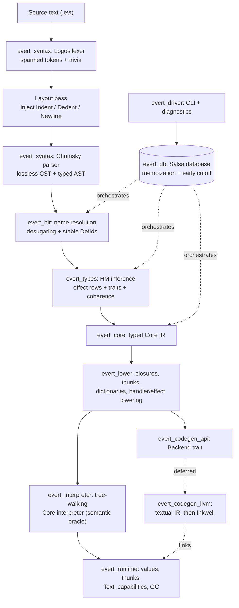

# 0. Agent Action Plan

## 0.1 Product Understanding

### 0.1.1 Core Product Vision

Based on the prompt, the Blitzy platform understands that the new product is
**Evert** — a general-purpose programming language together with its reference
compiler and toolchain, implemented in **Rust**. Evert is conceived as
"inside-out Haskell": it retains the mathematical machinery of Haskell (monads,
lazy evaluation, referential transparency, pure functions, algebraic data
types) but inverts the defaults so that each capability is opt-in, local, and
explicitly invoked rather than globally imposed.

The product's governing rule, preserved exactly as the user expressed it, is:

> Power should be local, explicit, and non-contagious.

This thesis is codified in the user's foundational proposal (ECLP-0000) as ten
core tenets — among them: power is local; purity is enforceable, not
performative; strictness is the default and laziness is explicit; effects are
typed and handled rather than ambient; monads are abstractions rather than
penance; values are immutable unless scoped mutation says otherwise;
concurrency is structured; ownership is semantic rather than decorative; unsafe
code is explicit, fenced, and auditable; and diagnostics are a first-class part
of the language design.

The deliverable is therefore two intertwined artifacts: (a) a working compiler
implementation that realizes the Evert semantics, and (b) the **ECLP corpus
(ECLP-0000 through ECLP-0030)** — the user's "Evert Core Language Proposals" —
captured as the language's normative specification that the implementation is
built against.

#### Functional Requirements

The following functional requirements restate the user's intent with
implementation-grade clarity. The MVP implements the semantics through the
typed Core interpreter (FR-1 through FR-16); the remaining requirements are
realized as specification plus parser/grammar support, with runtime execution
staged behind the interpreter per the user's explicit "interpreter before LLVM"
directive.

- **FR-1 — Lexical analysis**: Tokenize Evert source into spanned tokens,
  retaining whitespace and comments as trivia for diagnostics, formatting, and
  lossless concrete syntax trees (CSTs), per ECLP-0002.
- **FR-2 — Layout pass**: Insert virtual `Indent`, `Dedent`, and `Newline`
  tokens between lexing and parsing so the grammar never sees raw whitespace,
  supporting Evert's "braces and layout both work" rule (ECLP-0025).
- **FR-3 — Parsing**: Produce a CST-first syntax tree with cuts and error
  recovery, covering the full surface grammar declared across the ECLPs
  (modules, data, records, traits, impls, effects, handlers, functions, actors,
  protocols, externs).
- **FR-4 — Name resolution and HIR**: Resolve names against module scopes,
  desugar surface syntax into a High-level Intermediate Representation (HIR),
  and assign stable definition identifiers (`DefId`).
- **FR-5 — Type inference**: Perform Hindley-Milner-style inference with
  higher-kinded type parameters (`M<_>`), requiring explicit signatures on
  public declarations while inferring private ones (ECLP-0005, ECLP-0006).
- **FR-6 — Effect-row inference and purity enforcement**: Infer structural
  effect rows on function arrows and enforce that `pure fn` resolves to an
  empty effect row (ECLP-0005).
- **FR-7 — Traits and coherence**: Resolve traits into dictionaries, forbid
  orphan instances by default, support higher-kinded traits and `deriving`
  (ECLP-0014).
- **FR-8 — Algebraic data types and matching**: Support sum/product types,
  records with nested immutable update, and exhaustiveness-checked pattern
  matching (ECLP-0004, ECLP-0008).
- **FR-9 — Laziness**: Implement `lazy` bindings and fields as pure, memoized
  thunks with black-hole detection on recursive forcing; reject effectful lazy
  expressions (ECLP-0009).
- **FR-10 — Monadicity**: Provide `Functor`/`Applicative`/`Monad` traits and
  generic `do M { ... }` notation that lowers to `flatMap`/`pure` (ECLP-0010).
- **FR-11 — Algebraic effects and handlers**: Declare effects as operation
  sets, perform them in direct style, and interpret them via resumable handlers;
  `Throw<E>` is a typed effect (ECLP-0011).
- **FR-12 — Local mutation**: Implement `mutate` regions whose mutable cells
  cannot escape, keeping the enclosing function referentially transparent
  (ECLP-0013).
- **FR-13 — Core IR and lowering**: Lower HIR into a small, explicitly typed
  Core calculus, selectively lowering resumable effects into
  continuation-passing form.
- **FR-14 — Interpretation**: Provide a tree-walking Core interpreter that
  serves as the semantic oracle for all conformance and golden tests.
- **FR-15 — Runtime values**: Represent immutable values, lazy thunks, real
  Unicode `Text` (not a list of characters), and capability-mediated I/O.
- **FR-16 — Diagnostics**: Emit source-level, human-first diagnostics that
  reference user constructs rather than generated scaffolding (ECLP-0005,
  ECLP-0025, ECLP-0030).
- **FR-17 — Command-line interface**: Ship a single `evert` driver that builds,
  checks, runs, tests, and formats projects (ECLP-0030's "one compiler command"
  mercy).
- **FR-18 — Backend boundary**: Define a narrow `Backend` trait and scaffold an
  LLVM backend, emitting textual LLVM IR first for golden testing.
- **FR-19 — Specification and conformance**: Ship the ECLP-0000–0030 corpus as
  repository documentation and encode its invariants as conformance tests.
- **FR-20 — Concurrency, ownership, and systems features (specified, runtime
  deferred)**: Parse and specify structured concurrency (nurseries, `spawn`,
  `await`, `race`, channels, `select`), actors and protocols, ownership modes,
  capabilities, `unsafe`/FFI, typed metaprogramming, and editions (ECLP-0016
  through ECLP-0029).

#### Non-Functional Requirements

- **Performance**: Strict-by-default evaluation, arena allocation, and string
  interning keep the common path off the heap and minimize allocator pressure.
- **Incrementality**: A demand-driven query architecture supports fast
  recomputation and future IDE responsiveness.
- **Diagnostic quality**: Every construct that cannot explain itself to a tired
  human "at 01:43" is considered a design defect (ECLP-0000); diagnostics are
  tested as first-class artifacts.
- **Determinism and testability**: A tree-walking interpreter acts as the
  single source of semantic truth so that backend bugs cannot masquerade as
  semantic bugs.
- **Safety**: Authority is capability-mediated and `unsafe` is an explicit,
  fenced effect.
- **Maintainability and evolvability**: A layered crate workspace with a narrow
  backend boundary and an editions mechanism allows the language to evolve
  without "extension confetti."
- **Portability**: The front end and interpreter are pure Rust with no native
  toolchain dependency; only the deferred LLVM backend requires a system LLVM
  installation.
- **Correctness**: Language invariants (purity, lazy-purity, exhaustiveness,
  coherence, region escape) are statically enforced by the compiler.

#### Implicit Requirements (Surfaced by the Compiler Domain)

The product domain — a statically typed functional/systems language compiler —
implies infrastructure the user did not enumerate but that the implementation
must provide: a span and source-map facility; a string interner producing
copyable `Symbol` identifiers; arena allocation with stable numeric
identifiers; a union-find structure for type and effect-row unification; an
offside-rule layout algorithm; a diagnostics renderer; Core/IR pretty-printers
for golden tests; a snapshot test harness; strongly-connected-component
detection for mutually recursive definition groups; a pattern-matrix
exhaustiveness checker; and a bootstrap prelude authored in Evert itself.

#### Constraints and Preferences

- Implementation language is Rust; the toolchain pipeline is fixed to Logos + a
  layout pass + Chumsky + Salsa + LLVM.
- The `peglet` meta-syntax is the normative notation for grammar sketches; it
  is described inline in the user's input and is not supplied as a separate
  file.
- Subtyping and type-level computation are explicitly omitted from version one.
- Quantum computing primitives are explicitly excluded.
- An interpreter must precede the LLVM backend.

### 0.1.2 User Instructions Interpretation

This sub-section captures every specific directive the user provided across the
four-message design conversation.

#### Technology Stack Directives

- Implement in **Rust**, governed by the rule (verbatim): *"Use Rust to
  implement Evert's semantics, not to encode Evert's semantics in Rust's type
  system."*
- Use the **Logos + Chumsky + Salsa + LLVM** stack, with a **layout pass
  inserted between Logos and Chumsky**. The user's exact stack annotation is
  preserved:

```text
Logos → layout pass → Chumsky → Salsa queries → custom Core IR → LLVM
```

- Use **Logos** for fast, spanned raw tokens; **Chumsky** for grammar, Pratt
  expressions, and error recovery; **Salsa** for incremental queries (source
  files, HIR, name resolution, inferred signatures, effect checking, lowered
  Core); and **LLVM strictly as a backend, never as Evert's semantic
  representation.**

#### Architecture Pattern Directives

- Build a multi-stage pipeline with a custom typed Core IR between Salsa and
  LLVM. The user's expanded pipeline is preserved verbatim:

```text
source text
  ↓
raw spanned tokens                  Logos
  ↓
layout expansion
  ↓
AST or lossless CST                 Chumsky
  ↓
HIR and stable DefIds
  ↓
kind, type, trait and effect inference
  ↓
explicitly typed Core
  ↓
closure, thunk and handler lowering
  ↓
monomorphic SSA-like LIR
  ↓
LLVM IR
```

- Two architectural rules stated as non-negotiable: *do not let borrowed lexer
  data escape into Salsa* (durable data uses byte spans, `FileId`, interned
  `Symbol`, `DefId`, and owned arena nodes), and *never store LLVM contexts,
  modules, or builders in Salsa* (quarantine them inside `evert_codegen_llvm`).
- Type inference should create a private, mutable `InferenceContext` per body,
  solve and "zonk" into an immutable result, and identify recursive definition
  groups as strongly connected components.
- **Build an interpreter before LLVM** so that "every semantic bug" does not
  "wear an optimiser moustache and deny everything."
- Lower effects and handlers into Evert's own continuation representation
  *before* LLVM sees them; only resumable algebraic effects need continuation
  machinery, while pure code, `Throw<E>`-only code, and non-resumable I/O lower
  more cheaply.

#### Integration Requirements

- Begin LLVM integration by emitting **textual LLVM IR** and invoking LLVM
  tools (for inspectable golden tests), with an embedded backend (Inkwell, with
  `llvm-sys` or a small C++ bridge for gaps) introduced later.
- The runtime is the implementer's responsibility: LLVM supplies stack maps and
  statepoints but no garbage collector, so the runtime provides its own
  non-moving tracing GC, shadow-stack roots, boxed closures/thunks, and a
  C-compatible runtime ABI.

#### Deployment Target

- A self-contained compiler CLI: the user's "small mercies" require that "one
  compiler command builds, tests, formats and runs the project." No web, GUI,
  or hosted-service deployment target is specified.

#### Specification Scope Directive

- The defining request of the final message: *"Please draft ECLP's (Evert Core
  Language Proposals) for each major capability … Start with core tenets,
  mission statement, data model, types, function model, module architecture,
  laziness, monadicity, etc. Then go wild … design a 1st class
  concurrency/ownership system that addresses the things that annoy you about
  Rust, Go, Swift and Mojolang (and steals liberally where it makes sense)."*
  The user further instructed: *"Don't add quantum computing primitives yet,"*
  and *"Use the attached peglet meta-syntax for representing language
  structures in a unified fashion, be aggressive about consistency, and
  encourage creativity."*

#### User Examples (Preserved Exactly As Given)

The following representative programs from the user's input are preserved
verbatim and become canonical fixtures under `examples/`.

User Example — the strict, effect-typed greeting program:

```evert
pure fn greeting(name: Text) -> Text =
    "Hello, {name}!"

fn main() ! Console {
    let name = Console.ask("What is your name? ")
    Console.say(greeting(name))
}
```

User Example — lazy, infinite streams:

```evert
data Stream<T> =
    End
  | Next(head: T, tail: lazy Stream<T>)

pure fn naturals(n: Int) -> Stream<Int> =
    Next(n, lazy naturals(n + 1))
```

User Example — encapsulated mutation inside a pure function:

```evert
pure fn histogram(
    values: Vector<Text>
) -> Map<Text, Int> =
    mutate {
        let counts = MutableMap<Text, Int>()

        for value in values {
            counts[value] = counts.getOr(value, 0) + 1
        }

        freeze(counts)
    }
```

Additional verbatim artifacts — the milestone set (M0–M12), the crate layout,
the Salsa query graph, and the `Type`/`EffectRow`/`ThunkState`/`Backend` Rust
sketches — are preserved in their corresponding sub-sections (0.3, 0.4, 0.5,
and 0.7).

### 0.1.3 Product Type Classification

- **Product category**: Programming-language toolchain — specifically an
  ahead-of-time compiler with an embedded tree-walking interpreter, delivered
  as a command-line tool (`evert`) backed by a Cargo workspace of reusable
  library crates. It is simultaneously a **language specification** project
  (the ECLP corpus).
- **Target users**:
  - *Language implementers and contributors* — the primary near-term audience,
    who build the compiler against the ECLP corpus.
  - *Evert application programmers* — the eventual audience, who want
    functional-systems programming without Haskell's pervasive laziness
    pitfalls or Rust's lifetime-annotation overhead in ordinary code.
  - *IDE and tooling authors* — served later through the demand-driven query
    API, which is designed to support responsive language-server features.
- **Scale expectations**: Production-grade *architecture* (layered crates,
  incremental queries, narrow backend boundary, editions) with an MVP-scoped
  *implementation* (front end through Core interpreter). The design anticipates
  self-hosting and native code generation but explicitly does not attempt them
  "in the inaugural commit."
- **Maintenance and evolution considerations**: Evolution proceeds through
  language **editions** (ECLP-0029) and feature gates rather than ad-hoc
  compiler flags; the ECLP format (ECLP-0001) gives every future capability a
  uniform, reviewable shape; and the interpreter-as-oracle discipline keeps the
  growing backend honest.

## 0.2 Background Research

Web search research conducted includes the current state of the four named
toolchain crates, the prevailing architecture of production Rust compilers and
language servers, and the version/compatibility constraints that bind the stack
together. The findings below confirm that the user's proposed stack is not only
viable but is the de-facto idiom for building a modern Rust-hosted compiler.

### 0.2.1 Technology Research

**Lexing with Logos.** Logos is a derive-driven lexer generator whose stated
goals are to make it easy to create a Lexer, so you can focus on more complex
problems, and to make the generated Lexer faster than anything you'd write by
hand. It achieves this because it combines all token definitions into a single
deterministic state machine, optimizes branches into lookup tables or jump
tables, prevents backtracking inside token definitions, unwinds loops and
batches reads to minimize bounds checking, and does all of that heavy lifting
at compile time. The current line emits tokens as a `Result`: the Lexer
produces a Result<Token, Token::Error> which removes the need for the #[error]
variant, and whitespace/trivia are declared with the #[logos(skip …)]
attribute. This directly supports FR-1 (spanned tokens) and the
trivia-retention requirement.

**Parsing with Chumsky.** Chumsky is a parser library for Rust that makes
writing expressive, high-performance parsers easy. Critically for Evert's
peglet notation and its layout-sensitive grammar, Chumsky's parsers are
recursive descent parsers and are capable of parsing parsing expression
grammars (PEGs), which includes all known context-free languages; it also
supports context-sensitive grammars via a set of dedicated combinators that
integrate cleanly with the rest of the library, allowing it to parse syntaxes
like Rust-style raw strings and Python-style semantic indentation. Its
error-recovery model matches FR-3: it can encounter a syntax error, report the
error, and then attempt to recover into a state in which it can continue
parsing so that multiple errors can be produced at once and a partial AST can
still be generated from the input for future compilation stages to consume. The
modern Chumsky line is the "zero-copy" rewrite, which added support for parsing
context-sensitive grammars such as Python-style indentation, support for
manipulating shared state during parsing (allowing arena allocators, cstrees,
and interners), and a new IterParser trait.

**Diagnostics with Ariadne.** Both Logos's and Chumsky's examples render errors
through Ariadne — error diagnostic rendering in the canonical example is
performed by Ariadne — which satisfies the first-class diagnostics
non-functional requirement and the FR-16 "source-level, human-first" mandate.

**Incremental computation with Salsa.** Salsa is a library for incremental
recomputation, meaning it allows reusing computations that were already done in
the past to increase the efficiency of future computations. Its proven pedigree
is decisive: the goal of Salsa is to support efficient incremental
recomputation, and Salsa is used in rust-analyzer, for example, to help it
recompile your program quickly as you type. The modern API models the compiler
as inputs and tracked functions: every Salsa program begins with an input —
special structs that define the starting point of your program — and everything
else is ultimately a deterministic function of these inputs.

**Code generation with LLVM via Inkwell.** Inkwell aims to help you pen your
own programming languages by safely wrapping llvm-sys; it provides a more
strongly typed interface than the underlying LLVM C API so that certain types
of errors can be caught at compile time instead of at LLVM's runtime,
replicating LLVM IR's strong typing as closely as possible. This is the
embedded path for the deferred backend, with the textual-IR path used first for
golden testing.

### 0.2.2 Architecture Pattern Research

The dominant production pattern for a Rust-hosted compiler front end is a
**demand-driven (query-based) architecture with a lossless syntax tree and a
strict separation of syntax from semantics**, as embodied by rust-analyzer.
Research confirms the key structural choices Evert should adopt:

- **Separation of syntax and semantics.** In rust-analyzer, the syntax layer
  provides a lossless CST/AST, while HIR
  provides semantic information. Evert mirrors this with `evert_syntax`
  (lossless CST) feeding `evert_hir` (resolved, desugared semantics).
- **Lossless concrete syntax trees.** rust-analyzer's parser produces a tree
  that includes all whitespace and
  comments, enabling perfect round-tripping, using the rowan library for
  immutable, thread-safe syntax trees. This validates Evert's CST-first grammar
  contract (ECLP-0002) and is the basis for formatting and IDE support.
- **Salsa-powered incrementality across the whole pipeline.** All analysis
  queries use the Salsa framework for automatic
  caching and invalidation. Evert's query graph follows the same shape.
- **Early-cutoff optimization.** A central reason to keep positions out of the
  AST is that changing the input source code to include an extra whitespace
  does not change the AST structure; early cutoff takes advantage of that and
  re-uses results which depend on the AST but not on the original source file,
  so AST computation "shields" the code higher in the stack from changes in the
  source code. This is the technical justification for the user's rule that
  durable Salsa data uses byte spans rather than borrowed source slices, and it
  informs how spans are stored.
- **Durability layering.** Salsa divides queries into more
  durable and more volatile, letting Salsa optimize accordingly — relevant to
  marking the Evert standard library and prelude as high-durability inputs so
  user edits do not invalidate prelude analysis.

Anti-patterns identified to avoid: storing borrowed lexer lifetimes or LLVM
mutable objects inside the incremental database (which would poison
incrementality and thread-safety), and compiling the entire program into
continuation-passing style when only resumable effects require it (which would
tax every function for machinery most never use). Both are explicitly avoided
per the user's directives and are reflected in the architecture.

### 0.2.3 Dependency and Tool Research

This sub-section records the latest stable versions and the compatibility
matrix that constrains the workspace.

| Component      | Verified version / constraint         | Notes for Evert                                                                                                                                                                                    |
| -------------- | ------------------------------------- | -------------------------------------------------------------------------------------------------------------------------------------------------------------------------------------------------- |
| Logos          | 0.16.x (latest 0.16.1)                | Logos 0.16 rewrites the lexer engine, prioritizing correctness and robust regex support, and the Minimum Supported Rust Version (MSRV) has been bumped to 1.80 to leverage features like LazyLock. |
| Chumsky        | 0.11.x (zero-copy line; 1.0 in alpha) | Modern context-sensitive + error-recovery API; pairs with Ariadne.                                                                                                                                 |
| Ariadne        | ~0.4 (per Logos dev-deps)             | Diagnostic rendering; Logos's own dev-dependencies pin `ariadne ^0.4` and `chumsky ^0.10.0`, confirming first-class integration of the three.                                                      |
| Salsa          | Modern macro framework, pre-1.0       | Proven in rust-analyzer; uses `#[salsa::input]`/`#[salsa::tracked]`, interning, and durability.                                                                                                    |
| Inkwell        | 0.8.x                                 | Backend binding (deferred).                                                                                                                                                                        |
| LLVM           | 11–22 (pin one major)                 | Coupled to Inkwell feature flag.                                                                                                                                                                   |
| Rust toolchain | 2024 edition, ≥ 1.85                  | Required by Inkwell 0.8.                                                                                                                                                                           |

The binding constraint is the LLVM toolchain coupling. Inkwell requires Rust
1.85+ and one of LLVM 11–22, selected by pointing Cargo.toml to a single LLVM
version feature flag of the form llvmM-0 where M corresponds to the LLVM major
version. Because you must have LLVM installed on your system and specify the
version in your Cargo.toml dependencies, the LLVM backend is gated behind an
optional Cargo feature so the front end and interpreter build with no native
dependency — reinforcing the interpreter-first plan. Inkwell remains pre-1.0,
and the maintainers note they may make breaking changes on master from time to
time since they are pre-v1.0.0, in compliance with semver, so the dependency is
pinned to an exact minor version.

**Supporting crates** selected to satisfy the implicit compiler-domain
requirements: `la-arena` (arena allocation with stable indices), `lasso` or
`string-interner` (interned `Symbol`), `rustc-hash` (`FxHashMap` for hot maps),
`ena` (union-find for type/row unification), `clap` (CLI parsing), and `insta`
(snapshot/golden testing). **Testing and CI patterns** follow the Rust
ecosystem standard: unit and integration tests via `cargo test`, snapshot tests
for diagnostics and IR pretty-printing, property tests for the lexer/layout
round-trip, and a CI workflow running `build`, `test`, `fmt --check`, `clippy`,
and `cargo-deny` (license/advisory auditing).

**Design system check.** No UI component library or design system is specified;
the product is a compiler CLI. The DESIGN SYSTEM ALIGNMENT PROTOCOL therefore
does not apply, and no "Design System Compliance" sub-section is produced. The
nearest analogs — the `peglet` grammar notation and the Ariadne diagnostic
format — are addressed in the architecture and interface sub-sections.

## 0.3 Technical Architecture Design

### 0.3.1 Technology Stack Selection

- **Primary language: Rust, 2024 edition (MSRV ≥ 1.85)** — Rationale: the user
  mandates Rust, and its enums model syntax and intermediate representations
  naturally while arenas, interning, and stable numeric IDs sidestep
  borrow-checker friction. MSRV 1.85 is the floor required by the chosen
  backend binding (Inkwell 0.8). The implementation realizes Evert's semantics
  in Rust rather than encoding Evert's type system into Rust's, per the
  governing implementation rule.
- **Lexer: Logos 0.16.x** — Rationale: it compiles token definitions into a
  single deterministic state machine for hand-written-beating speed, and the
  0.16 engine rewrite prioritizes regex correctness with an MSRV of 1.80,
  comfortably within our 1.85 floor. It emits `Result<Token, Error>` and
  declares trivia via `#[logos(skip ...)]`, exactly matching ECLP-0002's
  token/trivia split.
- **Parser: Chumsky 0.11.x** — Rationale: it is a recursive-descent/PEG
  combinator library — aligning with the `peglet` ordered-choice semantics —
  with first-class error recovery and native support for context-sensitive
  syntaxes including indentation, plus shared-state hooks for interners and
  arenas.
- **Incremental engine: Salsa (modern macro framework)** — Rationale: it
  provides demand-driven, memoized recomputation with early-cutoff and
  durability layering, and is battle-tested as the engine of rust-analyzer. It
  is the spine that turns the compiler into a query graph and underpins future
  IDE responsiveness.
- **Diagnostics: Ariadne (~0.4/0.5)** — Rationale: it is the rendering layer
  used by the Logos/Chumsky examples and produces the rich, source-anchored
  reports the language's diagnostics-as-design-element tenet demands.
- **Backend binding: Inkwell 0.8.x over LLVM (pinned major, e.g., LLVM 18 via
  `llvm18-0`)** — Rationale: Inkwell safely wraps `llvm-sys` with a strongly
  typed interface; it is feature-gated and optional so the LLVM toolchain is
  not required for the interpreter-first MVP. Textual LLVM IR is emitted first
  for inspectable golden tests, with the embedded Inkwell path following.
- **Supporting crates**: `la-arena` (arenas + stable indices), `lasso`/
  `string-interner` (interned `Symbol`), `rustc-hash` (`FxHashMap`), `ena`
  (union-find), `clap` (CLI), `insta` (snapshot tests). Rationale: these
  discharge the implicit compiler-domain infrastructure (interning, arenas,
  unification, golden testing) without bespoke reinvention.

### 0.3.2 Architecture Pattern

**Overall pattern: a query-based (demand-driven) compiler over a layered Cargo
workspace.** Following the rust-analyzer model — where the syntax layer
provides a lossless CST/AST and a separate HIR layer provides semantic
information, and all analysis flows through Salsa — Evert is decomposed into
single-responsibility crates wired together by a Salsa database. The user's
proposed crate layout is adopted verbatim as the workspace skeleton:

```text
evert_span
evert_syntax          # Logos, Chumsky, layout expansion
evert_db              # Salsa database and query declarations
evert_hir
evert_typeck
evert_core
evert_lower
evert_interpreter
evert_runtime
evert_codegen_api
evert_codegen_llvm
evert_driver
```

**Component interaction model.** Each compilation stage is a Salsa query that
consumes the immutable output of the prior stage. The end-to-end flow is shown
below.



**Data flow architecture.** The compiler is organized as the Salsa query graph
proposed by the user, preserved verbatim:

```text
source(FileId)
tokens(FileId)
parsed_file(FileId)
item_tree(FileId)
module_scope(ModuleId)
resolved_body(DefId)
inferred_signature(DefId)
typed_body(DefId)
core_body(DefId)
mono_instance(InstanceId)
codegen_unit(CodegenUnitId)
```

Type inference is the one stage that uses internal mutability: each
`typed_body` query constructs a private mutable `InferenceContext` holding
union-find tables, metavariables, and row constraints, then solves and "zonks"
everything into an immutable result before returning. Inference metavariables
are never stored in Salsa, and recursive definition groups are identified as
strongly connected components and inferred together.

**Security architecture.** Evert's safety model is capability-based
(ECLP-0020): effects such as `FileSystem`, `Network`, and `Clock` require
capability values, which can be restricted, wrapped, logged, or revoked, and
`unsafe` is itself a tracked effect (ECLP-0021). At the implementation level,
the compiler enforces the language invariants — `pure fn` ⇒ empty effect row,
`lazy` ⇒ pure, exhaustive matching, no orphan instances, imports have no
runtime effects, mutable values cannot escape a `mutate` region — as static
checks distributed across `evert_types`, `evert_hir`, and `evert_lower`.

### 0.3.3 Integration Points

- **LLVM backend boundary** — The `evert_codegen_api` crate defines a narrow
  `Backend` trait; the `evert_codegen_llvm` crate implements it. LLVM contexts,
  modules, and builders are confined to `evert_codegen_llvm` and never enter
  Salsa. The first integration emits textual LLVM IR and invokes LLVM
  command-line tools; the embedded Inkwell integration follows, selected by an
  LLVM-major feature flag.
- **Runtime ABI** — Generated code (and, transitionally, the interpreter's
  foreign operations) communicate with `evert_runtime` through a documented
  C-compatible ABI covering allocation, thunk forcing, `Text` operations,
  effect performance, and (later) task and channel primitives. LLVM supplies
  stack maps and statepoints but no collector, so the runtime owns garbage
  collection.
- **Salsa query-graph contract** — `evert_db` declares the inputs
  (`source(FileId)`) and tracked functions enumerated above. Durable inputs
  (prelude, standard library) are marked high-durability so user edits do not
  invalidate their analyses. No borrowed source slices cross this boundary;
  durable data is byte spans, `FileId`, interned `Symbol`, and `DefId`.
- **Package and edition system** — A package manifest declares its language
  edition (ECLP-0029); modules across editions interoperate only through typed
  interfaces. Imports are explicit and never execute code at import time
  (ECLP-0015).
- **CLI surface** — `evert_driver` exposes the single-command toolchain
  (`build`, `check`, `run`, `test`, `fmt`, and a `repl`), wiring user input
  into the query database and rendering Salsa-produced diagnostics through
  Ariadne.
- **Data exchange formats** — Source is UTF-8 `.evt` text; diagnostics
  serialize to both human-rendered and machine-readable (JSON) forms for editor
  consumption; intermediate representations expose deterministic pretty-printed
  text forms for golden testing.

## 0.4 Implementation Specifications

### 0.4.1 Core Components or Modules to Implement

Each component is a workspace crate with a single responsibility. Locations use
Rust module paths; the file-level breakdown appears in 0.5.

- **Component A: `evert_span`**
  - Purpose: spans, `FileId`, source maps, and the string interner producing
    copyable `Symbol` values.
  - Location: `crates/evert_span/src/lib.rs`
  - Key interfaces: `Span`, `FileId`, `SourceMap`, `Interner`, `Symbol`.
- **Component B: `evert_syntax`**
  - Purpose: Logos lexer, the layout pass, the Chumsky parser, and the lossless
    CST plus typed AST.
  - Location:
    `crates/evert_syntax/src/{lexer.rs, layout.rs, parser.rs, cst.rs, ast.rs}`
  - Dependencies: `evert_span`; Logos, Chumsky, Ariadne.
- **Component C: `evert_db`**
  - Purpose: the Salsa database and all query-group declarations.
  - Location: `crates/evert_db/src/lib.rs`
  - Key interfaces: `EvertDatabase`, the input `source(FileId)`, and tracked
    queries (`parsed_file`, `item_tree`, `module_scope`, `resolved_body`,
    `inferred_signature`, `typed_body`, `core_body`).
- **Component D: `evert_hir`**
  - Purpose: name resolution, desugaring, module scoping, and `DefId`
    assignment.
  - Location: `crates/evert_hir/src/{resolve.rs, lower_ast.rs, hir.rs}`
  - Dependencies: `evert_syntax`, `evert_span`, `evert_db`.
- **Component E: `evert_types`** (the user's `evert_typeck`)
  - Purpose: kinds, Hindley-Milner inference, effect rows, traits/coherence,
    deriving, and exhaustiveness checking; hosts the private `InferenceContext`.
  - Location:
    `crates/evert_types/src/{infer.rs, unify.rs, rows.rs, traits.rs, exhaustive.rs}`
  - Dependencies: `evert_hir`; `ena` (union-find).
- **Component F: `evert_core`**
  - Purpose: the explicitly typed Core calculus and its deterministic
    pretty-printer.
  - Location: `crates/evert_core/src/{core.rs, print.rs}`
- **Component G: `evert_lower`**
  - Purpose: lowering Core into runnable form — closure conversion, thunk
    insertion, dictionary elaboration, and `do`/effect/handler lowering
    (selective CPS for resumable effects).
  - Location:
    `crates/evert_lower/src/{closures.rs, thunks.rs, dicts.rs, effects.rs}`
- **Component H: `evert_interpreter`**
  - Purpose: the tree-walking Core interpreter that is the semantic oracle.
  - Location: `crates/evert_interpreter/src/{eval.rs, env.rs, handlers.rs}`
  - Dependencies: `evert_core`, `evert_lower`, `evert_runtime`.
- **Component I: `evert_runtime`**
  - Purpose: runtime values, lazy thunks (with black-hole detection and
    memoization), real Unicode `Text`, capability-mediated I/O, and the
    non-moving collector.
  - Location:
    `crates/evert_runtime/src/{value.rs, thunk.rs, text.rs, gc.rs, io.rs}`
- **Component J: `evert_codegen_api`**
  - Purpose: the narrow `Backend` trait and target specification.
  - Location: `crates/evert_codegen_api/src/lib.rs`
- **Component K: `evert_codegen_llvm`** (deferred / scaffold)
  - Purpose: the LLVM `Backend` implementation, textual-IR-first, then Inkwell.
  - Location: `crates/evert_codegen_llvm/src/lib.rs`
  - Dependencies: `evert_codegen_api`, `evert_lower`; Inkwell (optional
    feature).
- **Component L: `evert_driver`**
  - Purpose: the `evert` CLI binary, package/edition handling, and diagnostic
    rendering.
  - Location: `crates/evert_driver/src/main.rs`
  - Dependencies: `evert_db`, `evert_interpreter`, `evert_codegen_api`; `clap`,
    Ariadne.

### 0.4.2 Data Models and Schemas

**Source-level value classes (ECLP-0004).** Evert exposes five semantic value
classes, preserved verbatim:

```text
Plain value       immutable, shareable, no observable identity
Lazy value        pure suspended computation, memoized after forcing
Resource value    linear or affine value with deterministic finalization
Cell value        region-bound mutable storage
Capability value  authority to perform an effect, access a service, or communicate
```

**Representative algebraic data types and records (ECLP-0004).** These become
the prelude's core definitions:

```evert
data Option<T> =
    None
  | Some(T)

data Result<T, E> =
    Ok(T)
  | Err(E)

record User {
    id: UserId,
    name: Text,
    email: Option<Text>
}
```

**Compiler-internal type representation.** The internal type and effect-row
model is adopted verbatim from the user's Rust sketch; identifiers are arena
indices, and unification runs over these IDs via union-find:

```rust
#[derive(Clone, Copy, Debug, PartialEq, Eq, Hash)]
struct TypeId(u32);

#[derive(Clone, Copy, Debug, PartialEq, Eq, Hash)]
struct RowId(u32);

enum Type {
    Variable(TypeVariable),
    Constructor(Symbol),

    Application {
        constructor: TypeId,
        arguments: Vec<TypeId>,
    },

    Function {
        parameter: TypeId,
        result: TypeId,
        effects: RowId,
    },
}

enum EffectRow {
    Empty,

    Extend {
        effect: EffectId,
        tail: RowVariable,
    },

    Variable(RowVariable),
}
```

**Runtime laziness model.** Lazy values are heap thunks with a three-state
machine, adopted verbatim from the user's sketch; forcing returns the cached
value, marks suspended thunks `Evaluating` to detect recursive forcing
(black-holing), invokes the closure, and replaces it with the result:

```rust
enum ThunkState {
    Suspended(Closure),
    Evaluating,
    Evaluated(Value),
}

struct Thunk {
    state: GcCell<ThunkState>,
}
```

**Schema-level validation rules.** The compiler enforces these data-model
invariants: constructors are total functions; record update produces a new
value unless the receiver is a mutable cell; equality is never implicit for
functions, effects, actors, tasks, or resources; destructors exist only for
resource values; and a `lazy` value's defining expression must be pure.

### 0.4.3 Internal and Command-Line API Specifications

**Internal query API (Salsa).** The compiler's primary internal contract is the
query graph in 0.3.2. Tracked functions take a database reference and a Salsa
struct, return clone-able immutable values, and are memoized with early cutoff.
Inputs are set on the database (e.g., `source(FileId) = contents`) by the
driver.

**Internal codegen API.** The backend boundary is the user's `Backend` trait,
preserved verbatim:

```rust
pub trait Backend {
    type Artifact;

    fn compile(
        &self,
        module: &MonoModule,
        target: &TargetSpec,
    ) -> Result<Self::Artifact, CodegenError>;
}
```

**Command-line API.** The `evert` driver exposes a single-command toolchain
(ECLP-0030's "small mercy"):

| Command            | Purpose                                               | Notes                            |
| ------------------ | ----------------------------------------------------- | -------------------------------- |
| `evert build`      | Type-check, lower, and (optionally) codegen a package | Backend selected by feature/flag |
| `evert check`      | Front-end analysis and diagnostics only               | Fastest feedback loop            |
| `evert run <file>` | Execute a program through the Core interpreter        | MVP execution path               |
| `evert test`       | Run conformance and project tests                     | Drives the interpreter oracle    |
| `evert fmt`        | Format source using the lossless CST                  | Layout/braces preserving         |
| `evert repl`       | Interactive evaluation                                | Built on the interpreter         |

There is no network or REST API surface; the only external interface beyond the
CLI is the editor-facing diagnostic JSON and the (future) language-server query
API.

### 0.4.4 User Interface Design (Diagnostics)

Evert has no graphical UI; its "interface" is the command line and, above all,
its diagnostics — a first-class design surface per ECLP-0000 and ECLP-0025. The
key insights, goals, and required behaviors drawn directly from the user's
instructions are:

- **Goal — explain, don't intimidate.** Errors must describe source-level
  constructs, not generated dictionaries or monadic scaffolding. The purity
  violation diagnostic the user specified is the canonical target:

```text
Clock.now performs Clock.
pure fn nowish permits no effects.
```

- **Goal — actionable choices.** Where appropriate, diagnostics offer concrete
  remedies (e.g., the effect mismatch error that suggests moving the operation
  into an effectful caller, adding `! Console`, or handling `Console` locally)
  rather than "a seventeen-screen dissertation."
- **Requirement — rich source rendering.** The preferred diagnostic style,
  preserved verbatim, anchors the message to a span with a caret:

```text
error[E0312]: expected parameter name
  --> app.evt:12:18
   |
12 | fn greet(: Text) {
   |          ^ parameter name goes here
```

- **Requirement — recovery-friendly.** Because the parser recovers from errors,
  multiple diagnostics are produced in one pass; Ariadne renders them with
  spans drawn from the lossless CST.
- **Action — golden-tested.** Diagnostic output is captured as UI golden tests
  (`tests/ui/*.stderr`) so regressions in wording or span placement are caught
  automatically.

## 0.5 Repository Structure Planning

### 0.5.1 Proposed Repository Structure

The repository is a Cargo workspace. Each compiler stage is a crate under
`crates/`; the ECLP specification corpus, the Evert standard library, examples,
conformance tests, and all rule-mandated tooling files are first-class members
of the tree.

```text
/
├── Cargo.toml                       # Workspace manifest: members, shared deps, lints
├── Cargo.lock                       # Pinned dependency graph (committed for the binary)
├── rust-toolchain.toml              # Pin Rust 2024 edition, channel >= 1.85
├── rustfmt.toml                     # Formatting configuration
├── clippy.toml                      # Lint configuration thresholds
├── deny.toml                        # cargo-deny: license + advisory + ban rules
├── .gitignore                       # Ignore target/, local LLVM paths, editor cruft
├── LICENSE-APACHE                   # Apache-2.0 license
├── LICENSE-MIT                      # MIT license (dual-licensed, Rust convention)
├── README.md                        # Project overview, build/run, ECLP index
├── CHANGELOG.md                     # Edition- and milestone-keyed changes
├── .github/
│   └── workflows/
│       ├── ci.yml                   # build, test, fmt --check, clippy, cargo-deny
│       └── release.yml              # Tagged release artifacts
├── crates/
│   ├── evert_span/                  # Spans, FileId, source maps, interner/Symbol
│   │   ├── Cargo.toml
│   │   └── src/lib.rs
│   ├── evert_syntax/                # Lexer, layout pass, parser, CST/AST
│   │   ├── Cargo.toml
│   │   └── src/
│   │       ├── lib.rs
│   │       ├── lexer.rs             # Logos token definitions (ECLP-0002)
│   │       ├── layout.rs            # Offside-rule Indent/Dedent/Newline injection
│   │       ├── parser.rs            # Chumsky grammar, Pratt blocks, recovery
│   │       ├── cst.rs               # Lossless concrete syntax tree
│   │       └── ast.rs               # Typed abstract syntax tree
│   ├── evert_db/                    # Salsa database + query declarations
│   │   ├── Cargo.toml
│   │   └── src/lib.rs
│   ├── evert_hir/                   # Name resolution, desugaring, DefIds
│   │   ├── Cargo.toml
│   │   └── src/{lib.rs, resolve.rs, lower_ast.rs, hir.rs}
│   ├── evert_types/                 # Inference, rows, traits, coherence, exhaustiveness
│   │   ├── Cargo.toml
│   │   └── src/{lib.rs, infer.rs, unify.rs, rows.rs, traits.rs, exhaustive.rs}
│   ├── evert_core/                  # Typed Core calculus + pretty-printer
│   │   ├── Cargo.toml
│   │   └── src/{lib.rs, core.rs, print.rs}
│   ├── evert_lower/                 # Closures, thunks, dictionaries, effect lowering
│   │   ├── Cargo.toml
│   │   └── src/{lib.rs, closures.rs, thunks.rs, dicts.rs, effects.rs}
│   ├── evert_interpreter/           # Tree-walking Core interpreter (semantic oracle)
│   │   ├── Cargo.toml
│   │   └── src/{lib.rs, eval.rs, env.rs, handlers.rs}
│   ├── evert_runtime/               # Values, thunks, Text, capabilities, GC, I/O
│   │   ├── Cargo.toml
│   │   └── src/{lib.rs, value.rs, thunk.rs, text.rs, gc.rs, io.rs}
│   ├── evert_codegen_api/           # Backend trait + TargetSpec
│   │   ├── Cargo.toml
│   │   └── src/lib.rs
│   ├── evert_codegen_llvm/          # LLVM backend (deferred; feature-gated)
│   │   ├── Cargo.toml
│   │   └── src/lib.rs
│   └── evert_driver/                # `evert` CLI binary
│       ├── Cargo.toml
│       └── src/{main.rs, cli.rs, diagnostics.rs, package.rs}
├── stdlib/
│   └── std/
│       ├── prelude.evt              # Unit, Bool, Int, Option, Result, Vector, traits...
│       ├── option.evt               # Option<T> and combinators
│       ├── result.evt               # Result<T, E> and combinators
│       ├── text.evt                 # Real Unicode Text API
│       ├── collections.evt          # Vector, Map, Set
│       └── stream.evt               # Lazy Stream<T>
├── examples/
│   ├── greeting.evt                 # Verbatim user example (strict + Console effect)
│   ├── register.evt                 # Verbatim user example (Throw + effects + match)
│   ├── histogram.evt                # Verbatim user example (mutate region)
│   ├── streams.evt                  # Verbatim user example (lazy Stream / naturals)
│   └── app_main.evt                 # Verbatim unified example (module app.main)
├── tests/
│   ├── conformance/                 # ECLP invariants as executable tests
│   │   ├── purity.rs                # pure fn ⇒ empty effect row (ECLP-0005)
│   │   ├── laziness.rs              # lazy ⇒ pure; black-hole; memoization (ECLP-0009)
│   │   ├── exhaustiveness.rs        # non-exhaustive match rejected (ECLP-0008)
│   │   ├── coherence.rs             # orphan instances rejected (ECLP-0014)
│   │   └── regions.rs               # mutable values cannot escape mutate (ECLP-0013)
│   ├── ui/                          # Diagnostic golden tests (.evt + .stderr pairs)
│   └── snapshots/                   # insta snapshots for IR pretty-printers
├── docs/
│   ├── eclp/                        # The specification corpus
│   │   ├── ECLP-0000-mission.md
│   │   ├── ECLP-0001-format.md
│   │   ├── ...                      # one file per proposal
│   │   └── ECLP-0030-refusals.md
│   ├── grammar/
│   │   └── evert.peglet             # Normative peglet grammar sketches (ECLP-0002+)
│   ├── architecture/
│   │   └── pipeline.md              # Pipeline + query graph documentation
│   └── guides/
│       └── getting-started.md
└── xtask/                           # Build/automation helpers (optional)
    ├── Cargo.toml
    └── src/main.rs
```

### 0.5.2 File Path Specifications

- **Core application files**:
  - `crates/evert_syntax/src/lexer.rs` — Logos token enum implementing the
    ECLP-0002 token and trivia set.
  - `crates/evert_syntax/src/layout.rs` — the offside-rule pass that injects
    `Indent`/`Dedent`/`Newline`.
  - `crates/evert_syntax/src/parser.rs` — Chumsky grammar mirroring the peglet
    rules, with cuts and `recover` clauses.
  - `crates/evert_types/src/infer.rs` — the `InferenceContext`, HM unification,
    and effect-row solving; `crates/evert_types/src/exhaustive.rs` — the match
    exhaustiveness checker.
  - `crates/evert_core/src/core.rs` — the typed Core forms (`Var`, `Let`,
    `Lambda`, `Apply`, `Constructor`, `Match`, `Thunk`, `Force`, `Perform`,
    `Handle`, `Region`, `Mutate`, …).
  - `crates/evert_interpreter/src/eval.rs` — the tree-walking evaluator and
    `crates/evert_interpreter/src/handlers.rs` — resumable effect handling.
  - `crates/evert_runtime/src/thunk.rs` — the `ThunkState`/`Thunk` machinery;
    `crates/evert_runtime/src/text.rs` — real Unicode `Text`.
- **Configuration files**:
  - `Cargo.toml` (workspace) — central member list, shared dependency versions,
    and workspace lints.
  - `rust-toolchain.toml` — pins the 2024 edition and the ≥ 1.85 channel.
  - `rustfmt.toml`, `clippy.toml`, `deny.toml` — formatting, linting, and
    supply-chain policy.
- **Entry points**:
  - `crates/evert_driver/src/main.rs` — the `evert` CLI entry point.
  - `stdlib/std/prelude.evt` — the bootstrap prelude (authored in Evert),
    implicitly imported.
- **Specification and example assets**:
  - `docs/eclp/ECLP-00NN-*.md` — one Markdown file per proposal, the normative
    corpus.
  - `docs/grammar/evert.peglet` — the consolidated peglet grammar.
  - `examples/*.evt` — the user's verbatim programs, doubling as smoke tests.

## 0.6 Scope Definition

### 0.6.1 Explicitly In Scope

- **Workspace foundation**: the full Cargo workspace, all twelve `evert_*`
  crates, and every rule-mandated configuration file (`Cargo.toml`,
  `rust-toolchain.toml`, `rustfmt.toml`, `clippy.toml`, `deny.toml`,
  `.gitignore`, dual `LICENSE-*`, `README.md`, `CHANGELOG.md`) and the CI
  workflow (`.github/workflows/ci.yml`).
- **Lexer and layout**: a Logos lexer implementing the complete ECLP-0002 token
  and trivia set, plus the offside-rule layout pass producing `Indent`/`Dedent`/
  `Newline` (FR-1, FR-2).
- **Parser**: a Chumsky CST-first parser with cuts and error recovery covering
  the full surface grammar declared across the ECLPs — modules, `data`,
  `record`, `type`, `trait`, `impl`, `effect`, `handler`, `fn`/`pure fn`,
  `actor`, `protocol`, and `extern` declarations, plus expressions, patterns,
  and `do`/`match`/`handle`/`mutate`/`nursery`/`select` forms (FR-3).
- **Semantic analysis**: name resolution and HIR with stable `DefId`s (FR-4);
  Hindley-Milner inference with higher-kinded parameters and
  explicit-public/inferred-private signature checking (FR-5); effect-row
  inference and `pure fn` empty-row enforcement (FR-6); traits, coherence (no
  orphan instances), higher-kinded traits, and `deriving` (FR-7); ADTs, records
  with nested update, and exhaustiveness checking (FR-8).
- **Evaluation semantics through the interpreter**: typed Core IR and lowering
  (FR-13); the tree-walking Core interpreter as the semantic oracle (FR-14);
  laziness with pure-only thunks, memoization, and black-hole detection (FR-9);
  `Functor`/`Monad` traits and `do` notation (FR-10); algebraic effects with
  resumable handlers and `Throw<E>` (FR-11) for the MVP effect set (e.g.,
  `Console`, `Clock`, `Throw`); and `mutate` regions with escape checking
  (FR-12).
- **Runtime**: immutable values, thunks, real Unicode `Text`,
  capability-mediated I/O, and a non-moving reference-counted heap (FR-15).
- **Diagnostics and CLI**: source-level, recovery-friendly diagnostics rendered
  via Ariadne, golden-tested as UI tests (FR-16); the single `evert` driver with
  `build`/`check`/`run`/`test`/`fmt`/`repl` (FR-17).
- **Backend boundary**: the narrow `Backend` trait and an `evert_codegen_llvm`
  scaffold whose first path emits textual LLVM IR for golden testing (FR-18).
- **Specification and conformance**: the complete ECLP-0000–0030 corpus under
  `docs/eclp/`, the consolidated `docs/grammar/evert.peglet`, the verbatim
  example programs under `examples/`, and conformance tests encoding ECLP
  invariants (FR-19).
- **Standard library bootstrap**: `stdlib/std/prelude.evt` and the core modules
  (`option`, `result`, `text`, `collections`, `stream`) written in Evert.
- **Specified-but-staged surface (parsed and documented now)**: the
  concurrency, ownership, capability, `unsafe`/FFI, metaprogramming, and
  edition designs (ECLP-0016–0029) are in scope as normative specification and
  as parser/grammar coverage; their runtime execution is staged per 0.6.2.

### 0.6.2 Explicitly Out of Scope

- **Native LLVM object emission and the embedded Inkwell backend**: scaffolded
  behind a feature flag and exercised only via textual IR; full native codegen
  is deferred to milestone M12. The LLVM toolchain is not a build prerequisite
  for the MVP.
- **Bytecode virtual machine**: the user floated a bytecode VM as an option,
  but the MVP execution engine is the tree-walking interpreter; a VM is a
  possible later optimization, not an MVP deliverable.
- **Structured-concurrency runtime**: nurseries, `spawn`/`await`, `race`,
  channels/`select`, and the cancellation tree (ECLP-0017–0018, ECLP-0027–0028)
  are specified and parsed but not executed in the MVP (staged M9).
- **Ownership and resource-management runtime**: linear/affine checking,
  `using` finalizers, and `send`/`Send` transfer enforcement (ECLP-0016) are
  specified and parsed; full static enforcement is staged (M10).
- **Actors and protocols runtime** (ECLP-0019), **capability-security
  enforcement** (ECLP-0020), and **`unsafe`/FFI execution** (ECLP-0021) are
  specified but not executed in the MVP (staged M11+).
- **Typed metaprogramming engine** (ECLP-0024): specified; macro expansion is
  not implemented in the MVP.
- **Advanced garbage collection**: moving/generational collection and precise
  stack maps are out of scope; the MVP uses a non-moving reference-counted
  heap, and the resulting potential for leaking cyclic lazy structures (e.g.,
  `let rec ones = Next(1, lazy ones)`) is a documented, accepted limitation
  pending a later tracing collector.
- **Multi-shot continuations**: MVP handlers support one-shot resumption;
  cloning persistent continuation frames for multi-shot resumption is deferred.
- **IDE / language-server (LSP) binary**: the query API is designed to enable
  it, but no LSP server ships in the MVP.
- **Package registry and network dependency resolution**: editions and a local
  package manifest are in scope; a hosted registry is not.
- **Subtyping and type-level computation**: explicitly omitted from version one
  per the user.
- **Quantum computing primitives**: explicitly excluded by the user.

## 0.7 Deliverable Mapping

### 0.7.1 File Creation Plan

The table maps representative deliverables to their purpose, content type, and
priority. Priority reflects MVP criticality (High = required for the
interpreter-first MVP; Medium = required for completeness/quality; Low =
scaffold for deferred work).

| File Path                                                                               | Purpose                                         | Content Type   | Priority |
| --------------------------------------------------------------------------------------- | ----------------------------------------------- | -------------- | -------- |
| `Cargo.toml`                                                                            | Workspace manifest: members, shared deps, lints | Config         | High     |
| `rust-toolchain.toml`                                                                   | Pin 2024 edition, channel ≥ 1.85                | Config         | High     |
| `rustfmt.toml` / `clippy.toml` / `deny.toml`                                            | Formatting, lint, supply-chain policy           | Config         | High     |
| `.github/workflows/ci.yml`                                                              | build, test, fmt, clippy, cargo-deny            | CI/Config      | High     |
| `crates/evert_span/src/lib.rs`                                                          | Spans, FileId, interner, Symbol                 | Source         | High     |
| `crates/evert_syntax/src/lexer.rs`                                                      | Logos tokens (ECLP-0002)                        | Source         | High     |
| `crates/evert_syntax/src/layout.rs`                                                     | Offside-rule layout pass                        | Source         | High     |
| `crates/evert_syntax/src/parser.rs`                                                     | Chumsky grammar + recovery                      | Source         | High     |
| `crates/evert_db/src/lib.rs`                                                            | Salsa database + query graph                    | Source         | High     |
| `crates/evert_hir/src/resolve.rs`                                                       | Name resolution + DefIds                        | Source         | High     |
| `crates/evert_types/src/infer.rs`                                                       | HM inference + effect rows + InferenceContext   | Source         | High     |
| `crates/evert_types/src/exhaustive.rs`                                                  | Match exhaustiveness checker                    | Source         | High     |
| `crates/evert_core/src/core.rs`                                                         | Typed Core calculus                             | Source         | High     |
| `crates/evert_lower/src/effects.rs`                                                     | Selective CPS effect/handler lowering           | Source         | High     |
| `crates/evert_interpreter/src/eval.rs`                                                  | Tree-walking Core interpreter (oracle)          | Source         | High     |
| `crates/evert_runtime/src/thunk.rs`                                                     | ThunkState/Thunk, black-hole detection          | Source         | High     |
| `crates/evert_runtime/src/text.rs`                                                      | Real Unicode Text                               | Source         | High     |
| `crates/evert_codegen_api/src/lib.rs`                                                   | Backend trait + TargetSpec                      | Source         | Medium   |
| `crates/evert_codegen_llvm/src/lib.rs`                                                  | LLVM backend (textual IR first)                 | Source         | Low      |
| `crates/evert_driver/src/main.rs`                                                       | `evert` CLI entry point                         | Source         | High     |
| `stdlib/std/prelude.evt`                                                                | Bootstrap prelude in Evert                      | Source (Evert) | High     |
| `examples/greeting.evt`, `register.evt`, `histogram.evt`, `streams.evt`, `app_main.evt` | Verbatim user programs / smoke tests            | Source (Evert) | High     |
| `tests/conformance/purity.rs`                                                           | `pure fn` ⇒ empty row (ECLP-0005)               | Test           | High     |
| `tests/conformance/laziness.rs`                                                         | lazy purity, black-hole, memoization            | Test           | High     |
| `tests/conformance/exhaustiveness.rs`                                                   | non-exhaustive match rejected                   | Test           | High     |
| `tests/conformance/coherence.rs`                                                        | orphan instances rejected                       | Test           | Medium   |
| `tests/conformance/regions.rs`                                                          | mutate escape rejected                          | Test           | Medium   |
| `tests/ui/*.stderr`                                                                     | Diagnostic golden fixtures                      | Test           | Medium   |
| `docs/eclp/ECLP-0000-mission.md` … `ECLP-0030-refusals.md`                              | Specification corpus                            | Documentation  | High     |
| `docs/grammar/evert.peglet`                                                             | Normative peglet grammar                        | Documentation  | High     |
| `docs/architecture/pipeline.md`                                                         | Pipeline + query-graph docs                     | Documentation  | Medium   |
| `README.md` / `CHANGELOG.md`                                                            | Overview, build/run, change log                 | Documentation  | High     |

### 0.7.2 Implementation Phases

Work is organized by capability, not by calendar. The user's milestone set is
the canonical ordering and is preserved verbatim:

```text
M0  Lexer, layout pass, CST parser with recovery.
M1  Names, modules, ADTs, records, pattern matching.
M2  Hindley-Milner-ish inference with public signature checking.
M3  Effect rows and pure fn enforcement.
M4  Core lowering and interpreter.
M5  Lazy thunks, pure-only validation.
M6  Result, Option, traits, do notation.
M7  Local mutate regions.
M8  Basic handlers for Throw and Console-like effects.
M9  Structured nursery, spawn, await, cancellation.
M10 Linear resources, using, Send checking.
M11 Actors and protocols.
M12 LLVM backend.
```

These milestones map onto the standard build categories as follows:

- **Foundation** (M0): workspace, configuration, CI, `evert_span`, the lexer,
  the layout pass, and the recovering CST parser.
- **Core Logic** (M1–M8): name resolution and the HIR; HM inference with
  public-signature checking; effect rows and `pure fn` enforcement; Core
  lowering and the interpreter oracle; lazy thunks with pure-only validation;
  `Option`/`Result`/traits/`do`; `mutate` regions; and basic resumable handlers
  for `Throw` and `Console`-like effects. This block constitutes the executable
  MVP.
- **Interfaces** (M9–M12): structured concurrency, linear resources and `Send`
  checking, actors and protocols, and the LLVM backend. Per the scope
  boundaries, these are delivered as specification and parser coverage now,
  with runtime execution staged.
- **Testing** (continuous): conformance tests encode ECLP invariants; UI golden
  tests pin diagnostics; snapshot tests pin IR pretty-printing; property tests
  cover the lexer/layout round-trip. The crucial discipline, in the user's
  words, is to "build an interpreter before LLVM" so semantic bugs cannot hide
  behind the optimizer.
- **Documentation** (continuous): the ECLP corpus, the consolidated peglet
  grammar, the architecture notes, and the README/guides.

## 0.8 Attachments

### 0.8.1 Provided Files

No file attachments were provided with this project. All source material was
supplied inline within the conversation as Evert program snippets, peglet
grammar fragments, Rust implementation sketches, pipeline diagrams, the crate
layout, the Salsa query graph, and the milestone set — each of which has been
preserved verbatim in its corresponding sub-section (0.1, 0.3, 0.4, 0.5, and
0.7).

### 0.8.2 Figma Screens

No Figma frames or design assets were provided. Evert is a compiler and
command-line toolchain with no graphical user interface, so the Design System
Alignment Protocol does not apply.

### 0.8.3 Referenced Material

The `peglet` meta-syntax is not a delivered file; it is described inline in the
conversation as the normative notation for grammar sketches. Its defining
characteristics — explicit separation of tokens and trivia, declarative rule
constructors, Pratt expression blocks, cuts after distinctive prefixes, and
recovery clauses — are treated as authoritative for all grammar work and will
be materialized in the repository as `docs/grammar/evert.peglet`.

The conversation also cited external references that informed the architecture;
these are documented here as research provenance rather than ingestible assets:

- The Rust Compiler Development Guide (arena/interning memory strategy,
  HIR-versus-MIR separation, multi-backend codegen including LLVM and
  Cranelift, and demand-driven incremental queries).
- The Logos Handbook (the Logos-plus-Chumsky tokenizer/parser combination and
  borrowed-slice handling).
- The Salsa documentation (tracked and interned values for incremental
  recomputation).
- The Cranelift README (target-independent low-level IR with JIT and
  ahead-of-time use cases), noted as the deferred alternative backend.
- The LLVM Garbage Collection documentation (stack maps, safepoints, and GC
  statepoints, with no collector supplied), informing the custom runtime GC.
- The Rust standard library `OnceCell`/`OnceLock` documentation, informing the
  write-once portion of the thunk mechanism.
- The Mojo manual, used as a systems-language foil for the ownership and
  concurrency design.

## 0.9 Execution Patterns

### 0.9.1 Implementation Guidelines

The implementation follows the architectural guardrails established directly by
the user, which take precedence over generic Rust idioms:

- **Implement semantics, do not encode them in the host type system.** Use Rust
  to implement Evert's semantics, not to represent every Evert type as a nest
  of Rust lifetimes and generics. Higher-kinded parameters such as `M<_>` live
  in Evert's own type checker, never as attempts to persuade Rust that `M<_>`
  is a native constructor.
- **Enums for syntax and IR; arenas and stable IDs for durability.** Syntax
  trees and intermediate representations are Rust enums; durable compiler data
  uses byte spans, `FileId`, interned `Symbol`, `DefId`, and owned arena nodes
  so borrowed lexer slices never escape into the Salsa database.
- **Quarantine LLVM.** Salsa queries return immutable Evert IR or, at the very
  edge, object-code bytes. LLVM contexts, modules, and builders are never
  stored in Salsa; they remain confined to `evert_codegen_llvm`.
- **Inference is locally mutable, globally immutable.** Each `typed_body` query
  builds a private mutable `InferenceContext` (union-find metavariables and row
  constraints), solves and zonks to an immutable result, and exposes nothing
  mutable to Salsa. Recursive definition groups are inferred together as
  strongly connected components.
- **Interpreter before backend.** The tree-walking Core interpreter is the
  semantic oracle; the LLVM backend must reproduce its test suite. The
  `Backend` trait stays narrow, and textual LLVM IR is emitted first for
  inspectable golden tests.
- **Selective lowering.** Pure functions lower to ordinary calls, `Throw<E>` to
  `Result`-like control flow, and only resumable algebraic effects to
  continuation-passing form, so most code does not pay for machinery it never
  uses.
- **Deliberate v1 omissions.** Subtyping and type-level computation are
  excluded from the first version; the layout pass injects virtual braces and
  semicolons before parsing so whitespace handling never leaks into individual
  grammar rules.
- **Idiomatic, documented Rust throughout.** Code adheres to `rustfmt` defaults
  and a `deny`-level `clippy` profile, with every public item carrying a doc
  comment and every diagnostic describing source-level constructs rather than
  generated dictionaries or monadic scaffolding.

### 0.9.2 Quality Standards

Quality is defined by the language invariants the compiler must enforce and by
an executable test strategy that pins those invariants:

- **Language invariants (must be enforced and tested):** `pure fn` resolves to
  an empty effect row; `lazy` expressions must be pure; pattern matching is
  exhaustive unless the scrutinee type is open; public declarations require
  explicit type and effect signatures while private declarations may be
  inferred; orphan instances are rejected by default; imports execute no code;
  and mutable values may not escape their `mutate` region.
- **Test layering:** conformance tests assert each ECLP invariant (purity,
  laziness/black-hole, exhaustiveness, coherence, region escape); UI golden
  tests pin diagnostic text byte-for-byte; `insta` snapshot tests pin
  CST/HIR/Core pretty-printing; and property tests validate the
  lexer-plus-layout round-trip. Differential tests confirm the LLVM backend
  agrees with the interpreter oracle once present.
- **Coverage target:** at least 85% line and branch coverage for the front-end
  and semantic-analysis crates (`evert_syntax` through `evert_core`), which
  carry the correctness-critical logic; the deferred backend scaffold is held
  to a lower bar until M12.
- **Continuous integration gates:** every change must pass `cargo build`,
  `cargo test`, `cargo fmt --check`, `cargo clippy -D warnings`, and
  `cargo deny check` before merge.
- **Diagnostic quality bar:** following ECLP-0000, a construct that cannot
  explain itself clearly to a tired human does not ship; every error renders
  with a caret-anchored span and an actionable remedy, matching the style
  established in sub-section 0.4.4.
- **Security and safety standards:** authority is capability-gated per
  ECLP-0020 (no ambient `IO`), and all `unsafe` Rust in the runtime documents
  its aliasing, lifetime, and threading contracts with safe wrappers
  discharging them, consistent with ECLP-0021.
